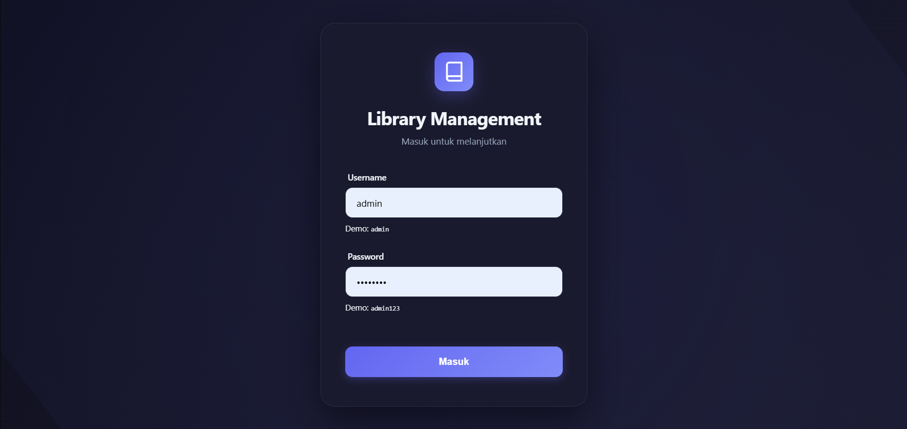
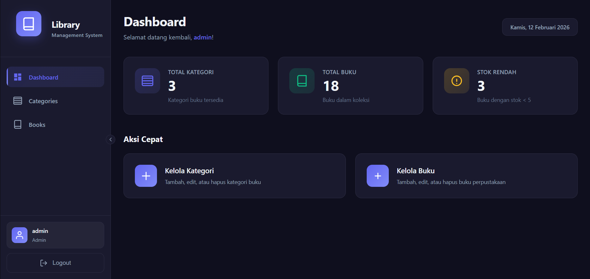
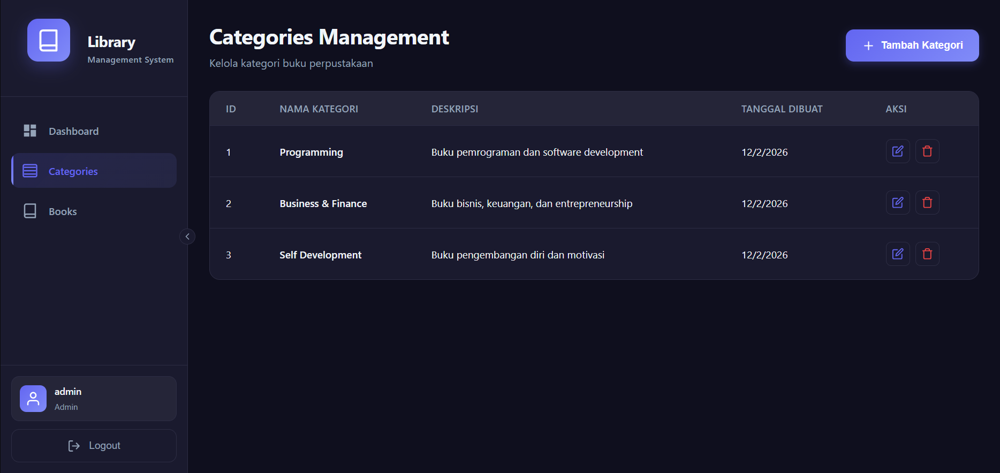
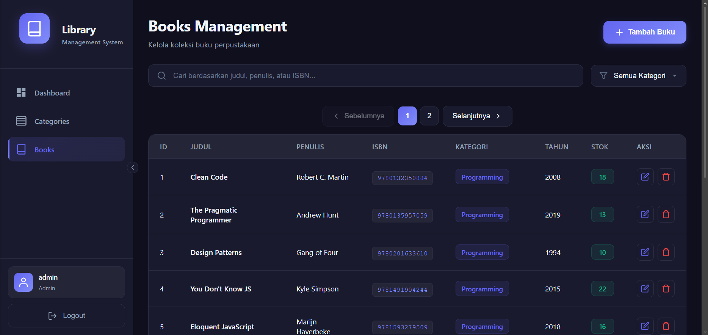
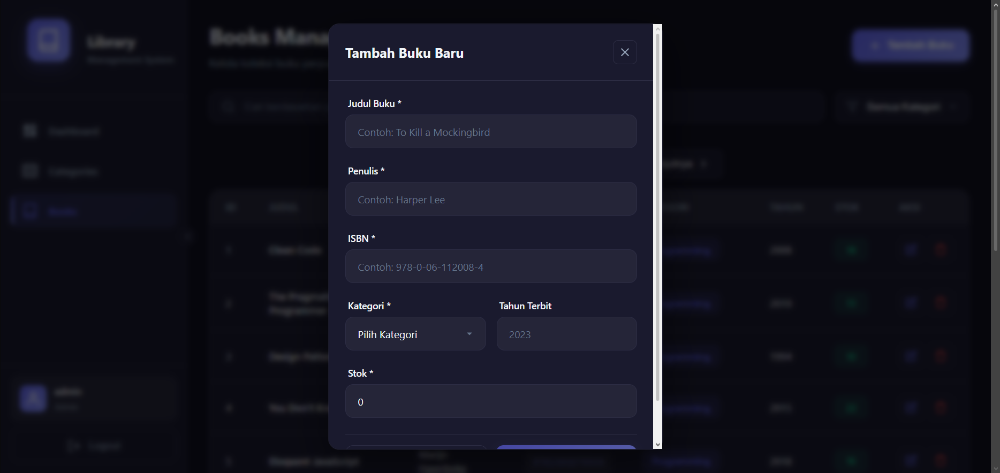

# 📚 Library Management System

A modern, full-stack Library Management System built with TypeScript, featuring a RESTful API backend and an interactive React frontend. This application provides a comprehensive solution for managing library resources including books, categories, and administrative operations.



## 🚀 Features

- **🔐 Authentication & Authorization** - Secure JWT-based authentication system
- **📖 Book Management** - Complete CRUD operations for managing library books
- **🗂️ Category Management** - Organize books into categories with full CRUD support
- **🔍 Search & Filter** - Advanced search functionality to find books quickly
- **📊 Dashboard** - Interactive dashboard with library statistics and overview
- **🎨 Modern UI** - Clean, responsive interface built with React
- **🔄 Real-time Updates** - Instant updates across the application
- **✅ Form Validation** - Client-side and server-side validation using express-validator
- **🛡️ Error Handling** - Comprehensive error handling and user feedback
- **📱 Responsive Design** - Works seamlessly on desktop and mobile devices

## 🛠️ Tech Stack

### Backend
- **Node.js** - JavaScript runtime environment
- **Express.js** - Fast, unopinionated web framework
- **TypeScript** - Type-safe JavaScript
- **MySQL2** - MySQL database driver with Promise support
- **JWT (jsonwebtoken)** - Secure authentication tokens
- **bcryptjs** - Password hashing
- **express-validator** - Request validation middleware
- **CORS** - Cross-Origin Resource Sharing
- **dotenv** - Environment variable management

### Frontend
- **React 18** - Modern UI library
- **TypeScript** - Type-safe development
- **Vite** - Next-generation frontend build tool
- **React Router DOM** - Client-side routing
- **Axios** - HTTP client for API requests
- **React Hook Form** - Performant form management
- **React Hot Toast** - Beautiful notifications

### Development Tools
- **ts-node** - TypeScript execution for Node.js
- **nodemon** - Auto-restart development server
- **@vitejs/plugin-react** - React plugin for Vite

## 📊 Database Design

The application uses a relational MySQL database with the following schema:

### Entity-Relationship Model

screenshots/databaseTable.png
```
┌─────────────────┐         ┌─────────────────┐
│   Categories    │         │      Books      │
├─────────────────┤         ├─────────────────┤
│ id (PK)         │────┐    │ id (PK)         │
│ name            │    │    │ title           │
│ description     │    │    │ author          │
│ created_at      │    │    │ isbn (UNIQUE)   │
│ updated_at      │    └────│ category_id(FK) │
└─────────────────┘         │ published_year  │
                            │ stock           │
                            │ created_at      │
                            │ updated_at      │
                            └─────────────────┘
```

### Tables

**Categories Table**
- `id` (INT, PRIMARY KEY, AUTO_INCREMENT) - Unique category identifier
- `name` (VARCHAR(100), NOT NULL) - Category name
- `description` (TEXT) - Category description
- `created_at` (TIMESTAMP) - Record creation timestamp
- `updated_at` (TIMESTAMP) - Record update timestamp

**Books Table**
- `id` (INT, PRIMARY KEY, AUTO_INCREMENT) - Unique book identifier
- `title` (VARCHAR(255), NOT NULL) - Book title
- `author` (VARCHAR(255), NOT NULL) - Book author
- `isbn` (VARCHAR(20), UNIQUE, NOT NULL) - International Standard Book Number
- `published_year` (INT) - Year of publication
- `stock` (INT, DEFAULT 0) - Available stock quantity
- `category_id` (INT, FOREIGN KEY) - Reference to categories table
- `created_at` (TIMESTAMP) - Record creation timestamp
- `updated_at` (TIMESTAMP) - Record update timestamp

### Relationships
- **One-to-Many**: Each Category can have multiple Books
- **Foreign Key**: `books.category_id` references `categories.id` with `ON DELETE SET NULL`

## 📸 Application Screenshots

### Login Page
The secure authentication interface for admin access.


### Dashboard
Overview of library statistics and quick access to main features.



### Category Management
Manage and organize book categories.



### Add Category
Create new categories for organizing books.


### Book Management
Browse, search, and manage the library's book collection.



### Add Book
Add new books to the library inventory.



## ⚙️ Installation & Setup

### Prerequisites

Before you begin, ensure you have the following installed:
- **Node.js** (v16 or higher)
- **npm** or **yarn**
- **MySQL** (v8.0 or higher)
- **XAMPP** (optional, for easy MySQL management)

### 1. Clone the Repository

```bash
git clone https://github.com/HHHAAAANNNNN/ts-library-management.git
cd ts-library-management
```

### 2. Database Setup

**Option A: Using phpMyAdmin (XAMPP)**
1. Start XAMPP and ensure MySQL is running
2. Open phpMyAdmin in your browser (usually `http://localhost/phpmyadmin`)
3. Create a new database named `library_management`
4. Import the schema: Go to Import tab and select `database/schema.sql`

**Option B: Using MySQL Command Line**
```bash
mysql -u root -p < database/schema.sql
```

### 3. Backend Setup

```bash
# Navigate to backend directory
cd backend

# Install dependencies
npm install

# Create environment file
cp .env.example .env

# Edit .env file with your database credentials
# DB_HOST=localhost
# DB_USER=root
# DB_PASSWORD=your_password
# DB_NAME=library_management
# JWT_SECRET=your_jwt_secret
# PORT=5000

# Start development server
npm run dev
```

The backend API will be available at `http://localhost:5000`

### 4. Frontend Setup

```bash
# Navigate to frontend directory (from project root)
cd frontend

# Install dependencies
npm install

# Start development server
npm run dev
```

The frontend application will be available at `http://localhost:3000`

## 📁 Project Structure

```
ts-library-management/
├── backend/                    # Backend API Server
│   ├── src/
│   │   ├── config/
│   │   │   └── database.ts    # MySQL connection pool
│   │   ├── controllers/       # Request handlers
│   │   │   ├── authController.ts
│   │   │   ├── bookController.ts
│   │   │   └── categoryController.ts
│   │   ├── middleware/        # Custom middleware
│   │   │   ├── authMiddleware.ts
│   │   │   └── errorHandler.ts
│   │   ├── models/           # Data models
│   │   │   ├── Book.ts
│   │   │   └── Category.ts
│   │   ├── routes/           # API routes
│   │   │   ├── authRoutes.ts
│   │   │   ├── bookRoutes.ts
│   │   │   └── categoryRoutes.ts
│   │   └── server.ts         # Entry point
│   ├── package.json
│   └── tsconfig.json
│
├── frontend/                  # React Application
│   ├── src/
│   │   ├── components/       # Reusable components
│   │   │   ├── BookModal.tsx
│   │   │   ├── CategoryModal.tsx
│   │   │   ├── Layout.tsx
│   │   │   ├── ProtectedRoute.tsx
│   │   │   └── Sidebar.tsx
│   │   ├── context/          # React Context
│   │   │   └── AuthContext.tsx
│   │   ├── pages/            # Page components
│   │   │   ├── Books.tsx
│   │   │   ├── Categories.tsx
│   │   │   ├── Dashboard.tsx
│   │   │   └── Login.tsx
│   │   ├── services/         # API services
│   │   │   └── api.ts
│   │   ├── types/            # TypeScript types
│   │   │   └── index.ts
│   │   ├── App.tsx           # Root component
│   │   ├── main.tsx          # Entry point
│   │   └── index.css         # Global styles
│   ├── package.json
│   ├── tsconfig.json
│   └── vite.config.ts
│
├── database/                  # Database files
│   └── schema.sql            # Database schema
│
├── screenshots/              # Application screenshots
│   ├── loginPage.png
│   ├── dashboardPage.png
│   ├── categoryPage.png
│   ├── addCategory.png
│   ├── bookPage.png
│   └── addBook.png
│
├── package.json              # Root package configuration
└── README.md                 # This file
```

## 🔌 API Endpoints

### Authentication

| Method | Endpoint | Description | Auth Required |
|--------|----------|-------------|---------------|
| POST | `/api/auth/login` | Admin login | No |

### Categories

| Method | Endpoint | Description | Auth Required |
|--------|----------|-------------|---------------|
| GET | `/api/categories` | Get all categories | Yes |
| GET | `/api/categories/:id` | Get category by ID | Yes |
| POST | `/api/categories` | Create new category | Yes |
| PUT | `/api/categories/:id` | Update category | Yes |
| DELETE | `/api/categories/:id` | Delete category | Yes |

### Books

| Method | Endpoint | Description | Auth Required |
|--------|----------|-------------|---------------|
| GET | `/api/books` | Get all books | Yes |
| GET | `/api/books/:id` | Get book by ID | Yes |
| POST | `/api/books` | Create new book | Yes |
| PUT | `/api/books/:id` | Update book | Yes |
| DELETE | `/api/books/:id` | Delete book | Yes |

**Note:** All protected endpoints require a valid JWT token in the Authorization header:
```
Authorization: Bearer <your_jwt_token>
```

## 💻 Usage

### Logging In
1. Navigate to the login page
2. Enter your admin credentials
3. Click "Login" to access the dashboard

### Managing Categories
1. Navigate to "Categories" from the sidebar
2. Click "Add Category" to create a new category
3. Fill in the category name and description
4. Use edit/delete buttons to modify or remove categories

### Managing Books
1. Navigate to "Books" from the sidebar
2. Click "Add Book" to add a new book
3. Fill in book details including title, author, ISBN, year, stock, and category
4. Use the search bar to find specific books
5. Use edit/delete buttons to modify or remove books

## 🏗️ Architecture

The application follows the **MVC (Model-View-Controller)** pattern:

- **Models**: Define data structures and database interactions
- **Views**: React components for the user interface
- **Controllers**: Handle business logic and request processing
- **Routes**: Define API endpoints and map to controllers
- **Middleware**: Handle authentication, validation, and error handling

## 🧪 Development

### Backend Development

```bash
cd backend
npm run dev     # Start with nodemon (auto-reload)
npm run build   # Build TypeScript to JavaScript
npm start       # Run production build
```

### Frontend Development

```bash
cd frontend
npm run dev     # Start development server with HMR
npm run build   # Build for production
npm run preview # Preview production build
```

## 📦 Dependencies Summary

### Backend Dependencies
- `express` - Web framework
- `mysql2` - MySQL client
- `cors` - Cross-origin resource sharing
- `dotenv` - Environment variables
- `bcryptjs` - Password hashing
- `jsonwebtoken` - JWT authentication
- `express-validator` - Request validation

### Frontend Dependencies
- `react` & `react-dom` - UI library
- `axios` - HTTP client
- `react-router-dom` - Routing
- `react-hook-form` - Form management
- `react-hot-toast` - Notifications

## 🤝 Contributing

Contributions are welcome! Please feel free to submit a Pull Request.

1. Fork the repository
2. Create your feature branch (`git checkout -b feature/AmazingFeature`)
3. Commit your changes (`git commit -m 'Add some AmazingFeature'`)
4. Push to the branch (`git push origin feature/AmazingFeature`)
5. Open a Pull Request

## 📝 License

This project is open source and available under the [MIT License](LICENSE).

## 👨‍💻 Author

**HHHAAAANNNNN**

- GitHub: [@HHHAAAANNNNN](https://github.com/HHHAAAANNNNN)

## 🙏 Acknowledgments

- Built with TypeScript for type safety
- React for modern UI development
- Express for robust backend API
- MySQL for reliable data storage

---

**Note:** Make sure to configure your database credentials in the backend `.env` file before running the application.
